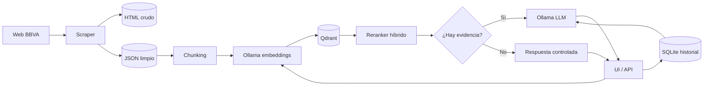

# Asistente RAG con web scraping

Solución de la prueba técnica para Machine Learning Engineer / AI Engineer. El sistema extrae contenido público del portal oficial de BBVA para Colombia, conserva los datos crudos y limpios, los indexa en una base vectorial y permite consultarlos desde una interfaz conversacional con fuentes, historial persistente y métricas de uso.

## Qué incluye

- Crawler limitado al dominio configurado, con lectura de `robots.txt`, demora entre solicitudes y límite de páginas.
- Persistencia local separada para HTML crudo (`data/raw`) y documentos normalizados (`data/clean`).
- División del texto con solapamiento, embeddings locales e indexación en Qdrant.
- Recuperación semántica y reranking híbrido (similitud vectorial + coincidencia léxica).
- Generación local con Ollama y una instrucción que obliga a responder con el contexto recuperado.
- Historial persistente por `session_id` en SQLite y ventana configurable de N mensajes.
- UI web minimalista, API documentada con OpenAPI y tablero de métricas.
- Manejo de validaciones, dependencias no disponibles y errores inesperados.
- Docker Compose para levantar aplicación, Qdrant, Ollama y descargar los modelos.

## Arquitectura



El código separa modelos y contratos de dominio (`app/domain`), casos de uso (`app/services`), adaptadores externos (`app/infrastructure`) y entrada HTTP (`app/api`). LangGraph coordina los nodos `load_history → retrieve → rerank → generate/answer_without_context → persist`. Esto permite sustituir Ollama, Qdrant o SQLite sin reescribir el flujo completo.

## Stack y decisiones

| Componente | Elección | Motivo |
|---|---|---|
| API | FastAPI | Validación, documentación automática y buen soporte asíncrono. |
| Orquestación RAG | LangGraph | Estado explícito, nodos verificables y decisión condicional según la evidencia. |
| Scraping | HTTPX + Beautiful Soup | Livianos, fáciles de probar y suficientes para páginas HTML renderizadas en servidor. |
| LLM | Ollama + `llama3.2:1b` | Ejecución local, sin API paga y respuesta viable en equipos sin GPU. |
| Embeddings | Ollama + `nomic-embed-text` | Modelo local y buena integración con el mismo runtime. |
| Vectores | Qdrant | Open source, persistente y preparado para búsqueda vectorial real. |
| Historial | SQLite + SQLAlchemy | Persistencia simple, portable y adecuada para una prueba individual. |
| Interfaz | HTML, CSS y JavaScript | Sin framework adicional; reduce dependencias y deja visible el flujo completo. |

## Requisitos previos

- Docker Desktop o Docker Engine con Docker Compose.
- Python 3.10 o superior si se ejecutan herramientas fuera de Docker.
- Al menos 6 GB de memoria disponible y cerca de 5 GB de disco para imágenes y modelos.
- Conexión a internet en el primer arranque, para descargar imágenes, modelos y contenido público.
- Los puertos `8000` libres. Qdrant y Ollama no se publican al host por seguridad.

No se necesitan claves ni APIs de pago.

## Ejecución desde cero

```bash
git clone <URL_DEL_REPOSITORIO>
cd <NOMBRE_DEL_REPOSITORIO>
cp .env.example .env
docker compose up --build -d
```

Ese comando levanta todos los servicios y descarga los modelos declarados. El primer inicio puede tardar varios minutos. Para revisar el progreso:

```bash
docker compose logs -f model-init
docker compose ps
```

Cuando `model-init` termine y `app` esté activo, realiza la ingesta inicial:

```bash
docker compose exec app python -m app.ingest
```

También puede iniciarse mediante la API:

```bash
curl -X POST http://localhost:8000/api/v1/ingestion
```

La ingesta es idempotente respecto a los identificadores de fragmentos: una nueva ejecución actualiza los mismos puntos y agrega el contenido nuevo.

## Uso

- Chat: [http://localhost:8000](http://localhost:8000)
- Métricas: [http://localhost:8000/static/analytics.html](http://localhost:8000/static/analytics.html)
- Documentación API: [http://localhost:8000/docs](http://localhost:8000/docs)

La interfaz crea un identificador de sesión local. “Nueva conversación” genera otro ID; cada uno mantiene su propio historial.

Ejemplo por API:

```bash
curl -X POST http://localhost:8000/api/v1/chat \
  -H 'Content-Type: application/json' \
  -d '{"session_id":"demo_001","question":"¿Qué información hay sobre cuentas de ahorro?"}'
```

Para detener la solución:

```bash
docker compose down
```

Los documentos, conversaciones, modelos y vectores persisten en volúmenes o en `data/`.

## Configuración

Todos los parámetros relevantes se externalizan en `.env`:

| Variable | Valor inicial | Uso |
|---|---:|---|
| `HISTORY_WINDOW` | `6` | Cantidad máxima de mensajes previos enviados al LLM. |
| `SCRAPE_MAX_PAGES` | `30` | Máximo de páginas por ejecución. |
| `SCRAPE_DELAY_SECONDS` | `0.5` | Pausa respetuosa entre solicitudes. |
| `CHUNK_SIZE` / `CHUNK_OVERLAP` | `900` / `150` | Tamaño y solapamiento en caracteres. |
| `RETRIEVAL_TOP_K` | `6` | Candidatos obtenidos de Qdrant. |
| `RERANK_TOP_K` | `3` | Fragmentos finales entregados al LLM. |
| `MIN_RELEVANCE_SCORE` | `0.25` | Puntaje mínimo para llamar al LLM; evita responder sin evidencia suficiente. |
| `CHAT_MODEL` | `llama3.2:1b` | Modelo generativo de Ollama. |
| `EMBEDDING_MODEL` | `nomic-embed-text` | Modelo de embeddings. |
| `SCRAPE_BASE_URL` | Portal BBVA Colombia | Punto de inicio del crawler. |
| `SCRAPE_PATH_PREFIX` | `/es/co/` | Evita recorrer secciones de otros países dentro del portal global. |
| `ALLOWED_DOMAINS` | dominios BBVA | Lista separada por comas para evitar salir del sitio. |

Si se cambia un modelo, ejecuta nuevamente `docker compose up -d`; `model-init` descargará el modelo configurado.

## Historial y análisis de impacto

SQLite conserva cada mensaje con rol, fecha, fuentes y latencia. El tablero recorre este histórico mediante:

- `GET /api/v1/conversations`: sesiones paginadas y cantidad de mensajes.
- `GET /api/v1/conversations/{session_id}`: conversación completa o limitada.
- `GET /api/v1/analytics`: sesiones, mensajes, preguntas, días activos, latencia media y preguntas por sesión.

Estas métricas permiten observar adopción, profundidad de uso y desempeño. En producción se agregarían retroalimentación explícita, resolución de intención, tasa de respuestas sin evidencia y ahorro estimado de tiempo.

## Patrones de diseño

1. **Repository** — `SQLConversationRepository` implementa `ConversationRepositoryPort`. Aísla consultas y persistencia del historial para que el caso de uso RAG no conozca SQLAlchemy.
2. **Factory** — `ProviderFactory` construye los adaptadores de embeddings, generación y vectores desde la configuración. Centraliza el ensamblaje y facilita incorporar otros proveedores.
3. **Strategy** — `RerankerStrategy` define el algoritmo de reranking y `HybridLexicalReranker` aporta la implementación actual. Puede reemplazarse por un cross-encoder sin modificar `RAGService`.
4. **Ports and Adapters (arquitectónico)** — los contratos de `app/domain/ports.py` invierten las dependencias entre los casos de uso y Ollama, Qdrant, archivos o SQLite. Mejora las pruebas con dobles locales.

LangGraph no reemplaza estos patrones: actúa como orquestador del caso de uso. La rama condicional evita invocar el modelo cuando no existe evidencia con el puntaje mínimo configurado.

## Pruebas

Las pruebas no requieren Ollama, Qdrant ni acceso web; usan adaptadores falsos para mantenerlas rápidas y deterministas.

```bash
make test
```

El comando crea una etapa Docker con las dependencias de desarrollo y ejecuta las pruebas en Python 3.11. Cubren división estable del texto, limpieza HTML, reranking, persistencia/métricas, adaptadores y las rutas del grafo RAG.

## Manejo de errores y seguridad

- Pydantic valida IDs y longitud de las preguntas.
- La API traduce fallos de conexión y respuestas inválidas de dependencias a errores HTTP entendibles.
- El crawler restringe esquema, dominio, extensiones, número de páginas y ritmo; además consulta `robots.txt`.
- El prompt trata el contenido web como datos y prohíbe seguir instrucciones incluidas en las fuentes, reduciendo el riesgo de prompt injection indirecta.
- Las respuestas incluyen enlaces a fuentes y reconocen cuando el contexto no basta.
- Los servicios internos no publican sus puertos en Docker Compose.

## Supuestos y limitaciones conocidas

- Solo se procesa HTML disponible en la respuesta inicial. Contenido cargado exclusivamente con JavaScript requeriría Playwright u otra herramienta de navegador.
- El reranker incluido es híbrido y gratuito; un cross-encoder suele ofrecer mayor precisión, con más consumo y latencia.
- SQLite es apropiado para esta entrega, pero múltiples réplicas deberían usar PostgreSQL.
- La ingesta se ejecuta manualmente para evitar modificar el índice en cada arranque. En producción se programaría y se registrarían versiones del contenido.
- No hay autenticación porque la prueba pide una interfaz funcional local. Es obligatoria antes de exponer datos internos.
- La fuente predeterminada es `https://www.bbva.com/es/co/`, porque el sitio comercial `bbva.com.co` devuelve HTTP 403 a clientes automatizados. El portal elegido es oficial y accesible, pero está orientado principalmente a noticias e información corporativa.
- La calidad depende de las páginas alcanzadas desde la URL inicial y del límite configurado.
- Las fuentes pueden cambiar después de la ingesta; la respuesta representa la última captura local.

## Futuras mejoras

- Ingesta incremental programada con detección de contenido modificado y eliminación de páginas obsoletas.
- Reranker cross-encoder multilingüe y evaluación offline con preguntas etiquetadas (Recall@K, MRR y fidelidad).
- Respuestas en streaming, filtros por categoría y citas a nivel de fragmento.
- Autenticación corporativa, control de roles, límites de uso y trazabilidad de auditoría.
- PostgreSQL para historial, workers para ingestas largas y observabilidad con OpenTelemetry.
- Retroalimentación útil/no útil y tablero de calidad además de adopción.

## Matriz de cumplimiento

| Lineamiento | Implementación |
|---|---|
| Python | Aplicación completa en Python 3.10+; contenedor oficial en Python 3.11. |
| Web scraping | `WebsiteScraper`, crudos y limpios en directorios distintos. |
| Base vectorial | Qdrant persistente. |
| Interfaz conversacional | UI web y endpoint `/api/v1/chat`, coordinados con LangGraph. |
| Historial por ID y N mensajes | SQLite, `session_id` y `HISTORY_WINDOW`. |
| Dockerización | `Dockerfile` y `docker-compose.yml`; un comando levanta servicios y modelos. |
| 3 patrones | Repository, Factory, Strategy; adicionalmente Ports and Adapters. |
| Análisis de datos | Tablero y endpoints de conversaciones/métricas. |
| Herramientas sin costo | Ollama, modelos abiertos, Qdrant y SQLite. |
| Bonus reranker | Reranking híbrido antes del LLM. |
| Bonus errores | Validación, logging y respuestas HTTP controladas. |
| Bonus configuración | `.env.example` con parámetros de modelos, historia, chunks y scraping. |

## Estructura principal

```text
app/
├── api/             # Rutas, validación y dependencias
├── domain/          # Modelos y contratos independientes
├── infrastructure/  # Ollama, Qdrant, SQLite y archivos
├── services/        # Scraping, indexación, reranking y RAG
└── static/          # Chat y tablero de métricas
tests/               # Pruebas deterministas
data/raw/            # HTML original (no versionado)
data/clean/          # JSON normalizado (no versionado)
```
